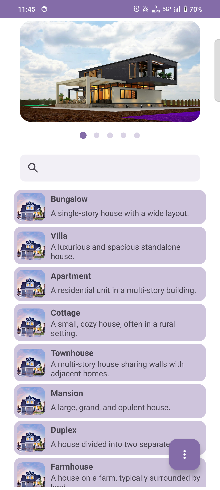
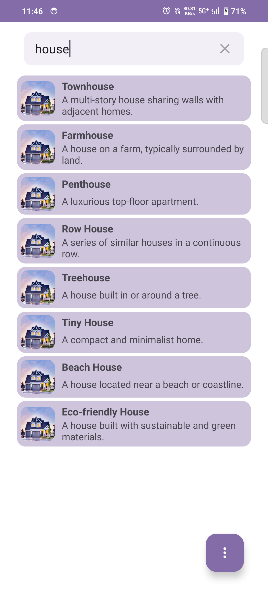
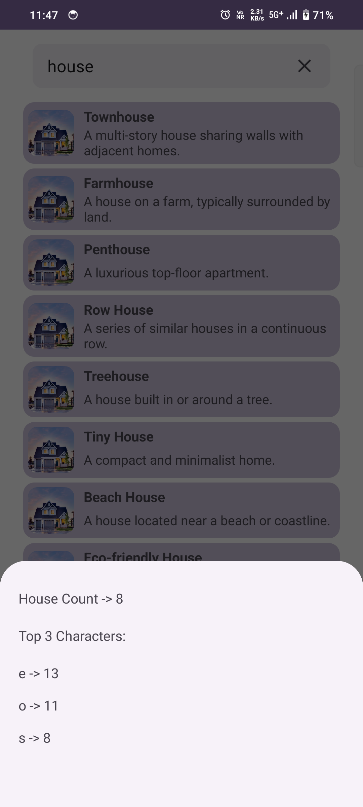
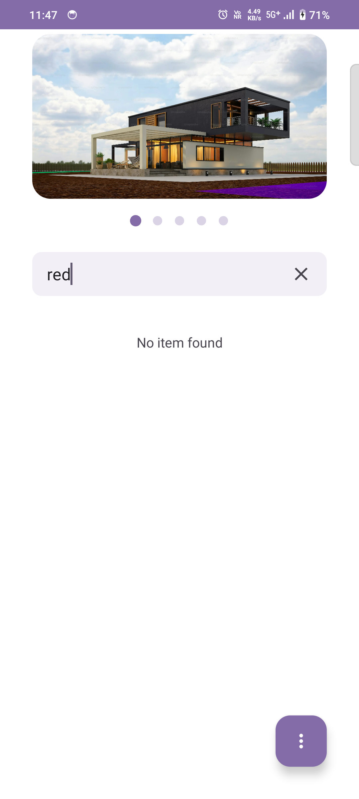

# Dynamic List with Image Category and Search App

This Android project demonstrates a dynamic list view with an integrated image category and search functionality.
The app fetches and displays data from a local source, allowing users to scroll through the list, search for specific items,
and view detailed information about each item.

## Features

1. **Image Category**
- Displays images in a category format.(e.g., HOUSE,BIRDS, VEHICLE, CLOTHES, TREES).
- Allows users to swipe left or right to navigate through images.
- Supports dynamic loading of images from local resources

2. **Dynamic Lists**
- Displays a list of items with titles and descriptions.
- Handles scrolling and updates the image category accordingly.
- Supports dynamic loading of items from local

3. **Search Functionality**
- Implements a search bar at the top of the screen.
- Filters the list items based on user input.
- Pins the search bar to the top when scrolling.

4. **Bottom Sheet Dialog**
- Shows a bottom sheet dialog when the floating action button is clicked.
- Displays statistics about the list items, including the count of items and the top 3 most frequent characters.

## Libraries Used

This application uses several libraries to provide a robust and efficient development experience. Below is a list of the libraries used in the Category App:

- **AndroidX Libraries:**
  - `androidx.core:core-ktx` - Provides Kotlin extensions for core Android components.
  - `androidx.appcompat:appcompat` - Adds support for modern Android features on older devices.
  - `androidx.activity:activity-ktx` - Provides Kotlin extensions for activity-related functions.
  - `androidx.constraintlayout:constraintlayout` - Used for flexible and efficient layouts by following a flat hierarchy.
  - `androidx.lifecycle:lifecycle-runtime-ktx` - Provides Kotlin extensions for lifecycle-aware components.
  - `androidx.fragment:fragment-ktx` - Offers Kotlin extensions for Fragment operations.

- **Material Design:**
  - `com.google.android.material:material` - Implements Material Design components and themes.

- **Dependency Injection:**
  - `dagger.hilt.android:hilt-android` - Simplifies dependency injection in Android applications.
  - `dagger.hilt.compiler:hilt-android-compiler` - Annotation processor for Hilt.
  - `androidx.hilt:hilt-compiler` - Hilt compiler for AndroidX integration.

These libraries enhance the functionality and maintainability of the Carousel App, making development more efficient and the app more reliable.

## Screenshots

---

Thank you for using the Category App !!!